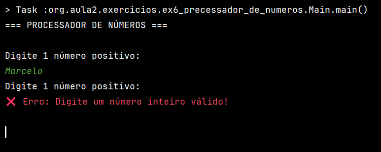
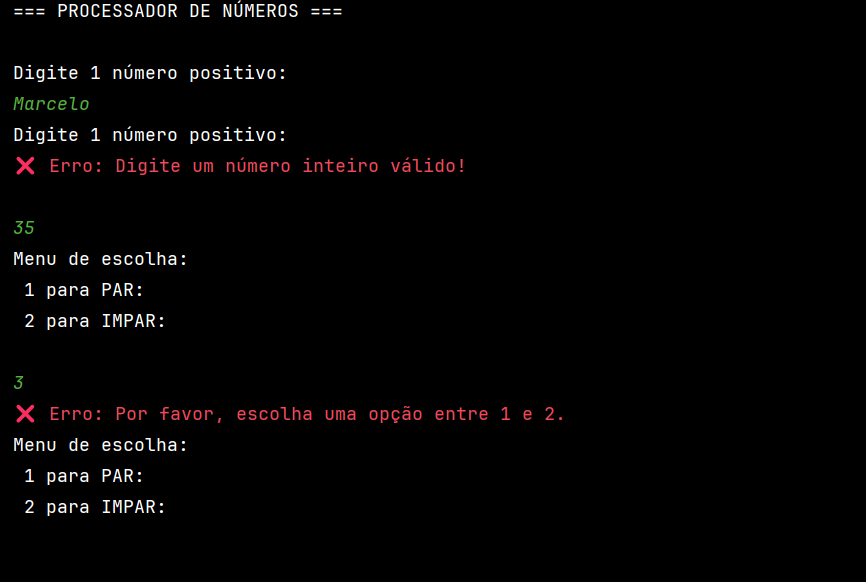
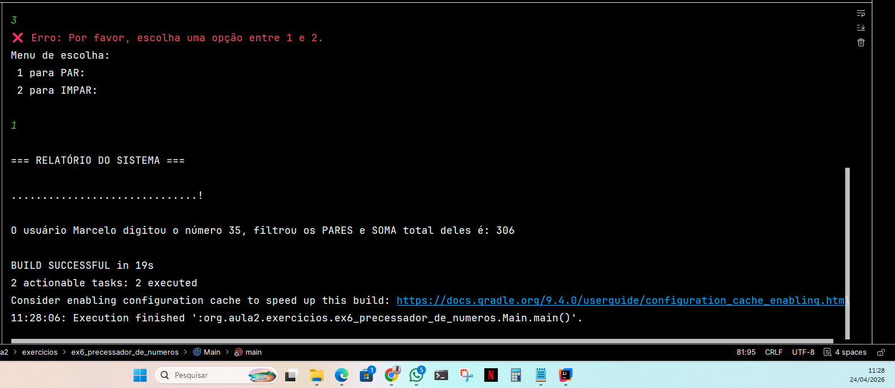

# 🧾 Processador de Números Orientado a Objetos

Este projeto nasceu de um desafio proposto no Bootcamp **Globant/DIO**, com o objetivo inicial de praticar lógica de programação básica em Java.

> **Desafio Original:** Criar um contador que percorre de 0 até um limite digitado pelo usuário, identifica números pares e exibe a soma total.

## 🧠 A Jornada de Aprendizado
O que começou como um simples loop `for` com uma condicional `if`, evoluiu através da curiosidade e do desejo de aplicar **padrões de mercado (Clean Code e SOLID)**. Em vez de entregar apenas o solicitado, decidi refatorar o código para explorar o máximo potencial da Orientação a Objetos:

1.  **Flexibilidade com Polimorfismo:** Transformei uma regra fixa de "pares" em um sistema de filtros intercambiáveis através de **Interfaces**, permitindo que o sistema processe Ímpares ou qualquer outra regra sem alterar o motor principal.

2.  **Resiliência e UX:** Implementei uma camada de tratamento de exceções com `try-catch` para garantir que o **software** não encerre abruptamente por erros de entrada do usuário (**letras** no lugar de **números**).

3.  **Componentização:** Criei o `LeitorConsole`, uma classe especialista em validar entradas, e utilizei **DTOs** (`Relatorio`) para o transporte seguro de dados.

---

## 📸 Demonstração Vizual sa Aplicação

### 1. Validação de Tipos (Anti-Crash)
O sistema detecta quando o usuário insere texto onde deveria haver um número, limpa o buffer do scanner e solicita a entrada novamente.

### 2. Validação de Regras de Negócio
Além de aceitar apenas números, o sistema garante que a opção escolhida esteja dentro dos limites do menu (1 ou 2).

### 3. Resultado Final e Relatório Encapsulado
Os dados processados são reunidos em um objeto de relatório, garantindo a integridade da informação exibida.

---

## 🛠️ Tecnologias e Conceitos Aplicados
* **Java 21** (Amazon Corretto)

* **Padrões de Projeto:** Strategy (Filtros), DTO (Relatório) e Service (Processador).

* **SOLID:** Princípios de Responsabilidade Única e Aberto/Fechado.

* **Gradle:** Gerenciamento de build e dependências.

---

### 👨‍💻 Autor
**Marcelo dos Santos Rodrigues** *Estudante de Ciência da Computação focado em criar soluções resilientes e bem estruturadas.*